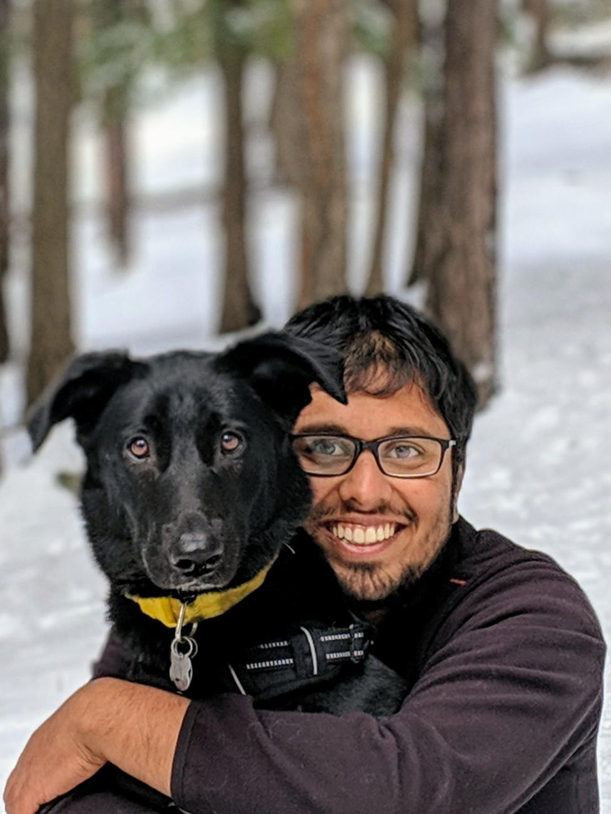

## Welcome!

My name is Arun Ravishankar and I am currently working towards my doctorate in Physics at the University of Arizona where I investigate stability of black holes. Prior to this, I obtained my Bachelor's in Pharmacy and Integrated Master's in Physics in India. In my spare time, I've been working on a project in computational cancer genomics. You can find more details of my experience in my [Resume](documents/Resume-Arun_Ravishankar.pdf).

I am keen to leverage my diverse and strong mathematical background to tackle important, interesting and challenging problems in the medical field using computational methods and AI. Some of the fields that interest me are - Organ-on-chips, Genomics, Medical Imaging, Medical Diagnosis, Drug discovery and development, Toxicology, Clinical Trials, Precision Medicine. I am also particularly interested in working towards reducing the use of animals in the pharmaceutical sciences.

I maintain an online presence on [Linkedin](https://linkedin.com/in/arunravishankar/). Feel free to connect or reach out to me at <arunravishankar@gmail.com>

---
