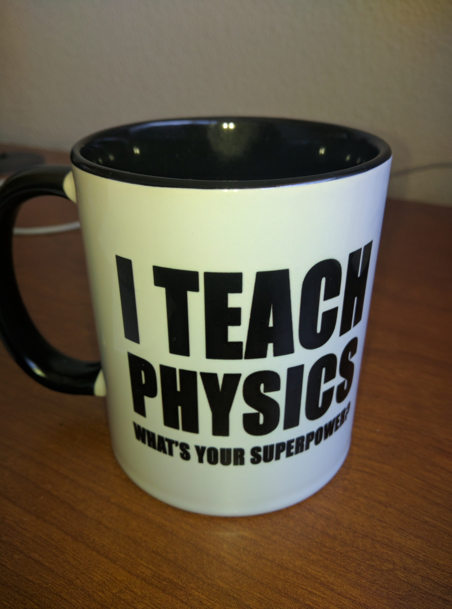
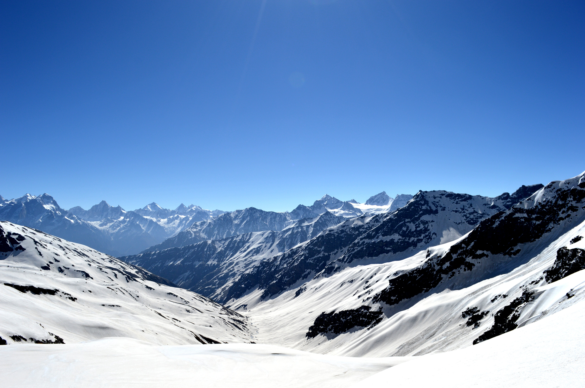

# Personal

* My passion for physics shows when I teach. I've always strived to be spread my enthusiasm with people whom I speak to - this is one of the biggest lessons I took away from my time with Ananthan and Ravi (two of my biggest inspirations, both of whom, happened to be my physics teachers during high school). Unfortunately Ananthan is no more - I wrote [this](https://medium.com/@arunravishankar/to-the-man-who-made-me-fc51bc6514b0) tribute to him. I was extremely happy when I received, for the first time as a teacher, this mug from a student of mine.

* I am very passionate about animal welfare and bringing justice to beings in need. I wrote [this](https://medium.com/@arunravishankar/all-this-is-normal-should-it-be-50c399011dc5) a few years back, hoping to educate people about the horrendous ways animals are treated. Regarding other people in need, those who are differently abled, I wrote [this](https://medium.com/@arunravishankar/why-do-abnormal-people-get-treated-differently-ae0e10c226ca) to just put my thoughts into words.

* I enjoy being one with nature whenever I find the time. I've had some really good times in the Alps, the Himalayas, the Rockies and the Catalina mountains. I used to maintain a [blog](https://thepolarbearwalk.tumblr.com/) of all the outdoorsy adventures I had. I stopped later on because I didn't really find the time to. Here's a photo from my longest climb - Rupin pass in the Himalayas at 15350 feet above sea level.

* My other major passion is Carnatic music. I learnt this southern Indian classical art form for many years in my childhood. Not a single day passes when I wouldn't have listened to at least 4-5 hours of this form of music. A large part of my worldview is influenced by this art form - creativity isn't just coming up with something completely new but is rather the act of navigating seamlessly through an elaborate framework/structure. Another way of saying this is that one becomes creative only when he/she has a deep, subconscious understanding of the framework. Why I say that this has influenced my world view is because I believe that there is importance in organization and structure.

* Last but not least, here's a photo of my universe.

