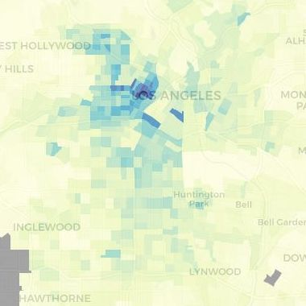

### Web Maps

#### **The LA Bus Map**
The map displays all LA Metro transit service for the past 24 hours, colored based on bus speed. The concept originally came from [Eric Fisher's](https://www.flickr.com/photos/walkingsf/4521616274/) transit maps, but the code from this particular project was forked from the [Boston Bus Map](http://bostonography.com/bus/). For Los Angeles, I used MapBox's TileMill to create custom map tiles for three different zoom levels and created separate layers to differentiate by local / rapid service.

*javascript, PHP, MySQL* ( [website](http://www.labusmap.com) / [code](http://www.github.com/black-tea) / [paper](documents/TRB2015_LABusMap_Paper.pdf) / [slides](documents/TRB2015_LABusMap_Slides.pdf) ) 

#### **LA Commute Map**
An R Shiny dashboard that displays the travel-to-work modeshare for census tracts within the Los Angeles region. In addition to showing the latest 5-year ACS estimate, the map also shows changes over time.

*R, Shiny* ( [website](http://104.236.5.1:3838/acs-commute-shiny/acs_commute/) / [code](https://github.com/black-tea/acs-commute-shiny))

---